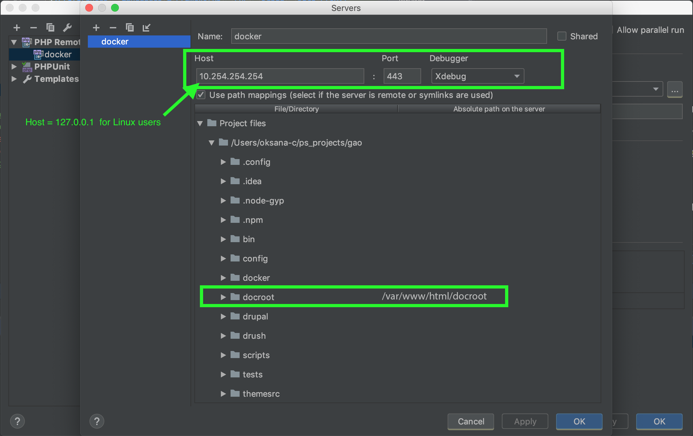

# Using xDebug with PhpStorm

Many thanks to [Oksana Cyrwus](https://github.com/oksana-c) for this solution!

## Configure IDE

### Set xDebug settings
Go to **_PhpStorm > Preferences_** (Linux shortcut: **_ctrl+alt+s_**; Mac shortcut: **_Cmd+_**, ) and check in **_Language & Frameworks / PHP / Debug_** looks like the image below

### Set PHP > Debug > DBGp Proxy settings
Go to **_Preferences > Languages & Frameworks > PHP > Debug > DBGp Proxy_** and follow the steps for each platform.

#### Mac OS

#### Linux

Since linux users are using localhost (127.0.0.1) and xDebug has PHPSTORM as ide_key, values below can be empty with an exception of the port.

### Update Debug Configuration

### Add Remote Server
Click the plus sign, add a new "PHP Remote Debug" setting, change "Name" to `docker`, fill `IDE Key` field, and click on periods icon (highlighted green below) to add a new server.

### Enable xDebug listener
Finally, click on the phone icon. If it turned green, xDebug is listening. Set some breakpoints and debug.

## Debug

### To Debug API calls made via PostMan

Add parameter/value pair `XDEBUG_SESSION_START=PHPSTORM` to the API endpoint URL and make a call with xDebug enable in PHPSTORM.

E.g. `http://${HOSTNAME}/api/v1/product?_format=json&XDEBUG_SESSION_START=PHPSTORM`, replacing `${HOSTNAME}` with the actual hostname for your project declared in your .env file
